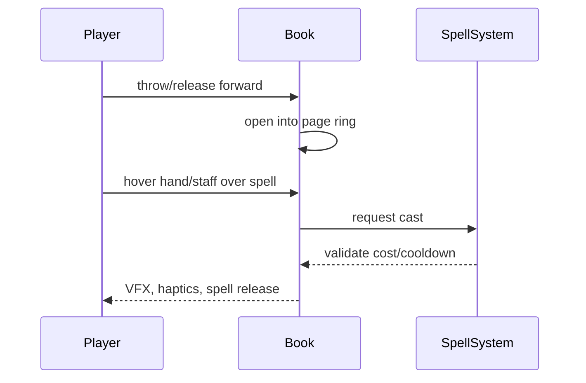

# Magic Combat

> Back to [VRMMO_INDEX.md](VRMMO_INDEX.md)  
> Master blueprint: [VRMMO_DESIGN_BLUEPRINT.md](VRMMO_DESIGN_BLUEPRINT.md)

## Identity

Magic is ritual, selection, and delivery. The mage uses a grimoire or spellbook to choose and prepare magic, then uses a staff, wand, hand, or incantation to shape the release.

## Equipment Roles

| Item | Role |
|---|---|
| Grimoire / Spellbook | spell knowledge, page selection, ritual casting |
| Staff / Wand | aiming, shaping, delivery |
| Spellstones | modular magical abilities and series powers |
| Robes / Focus items | Vitae efficiency, channel stability, cooldowns |

## Study Casting

Study casting is slow and flavorful:

1. open grimoire.
2. turn pages.
3. inspect diagrams.
4. select spell.
5. optionally speak incantation.
6. cast ritual, utility, buff, or exploration magic.

## Combat Casting

Combat mode:

- grip grimoire.
- throw it forward.
- pages separate into a ring.
- hover over spell.
- cast with staff, wand, hand release, or incantation.
- book collapses and returns.

## Incantations

| Result | Effect |
|---|---|
| none | normal cast |
| correct | potency, cost, speed, or special modifier |
| partial | small or unstable bonus |
| wrong | no bonus or harmless fizz |

Voice should be optional, never required for core combat.

