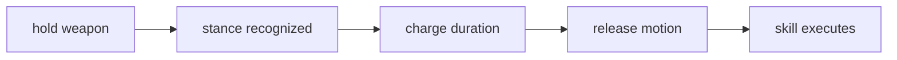

# Melee Combat

> Back to [VRMMO_INDEX.md](VRMMO_INDEX.md)  
> Master blueprint: [VRMMO_DESIGN_BLUEPRINT.md](VRMMO_DESIGN_BLUEPRINT.md)

## Identity

Melee skills are activated through stance, grip, hold duration, and release motion. The player should feel like they are performing a martial technique, not selecting a skill from a bar.

## Core Flow

## Progression

| Stage | Access | Role |
|---|---|---|
| Novice | 4 one-handed stances | simple early combat |
| Adept | 4 two-handed stances | stronger committed skills |
| Expert | stance chains | combos and expression |
| Master | cancels, counters, signature arts | high mastery ceiling |

## Example Stances

| Stance | Skill Type |
|---|---|
| High guard | overhead slash, wind slash |
| Low guard | rising slash, draw cut |
| Side guard | sweeping cut, cleave |
| Forward point | thrust, dash pierce |
| Two-hand overhead | crescent wave, heavy cleave |
| Two-hand low draw | iai slash, shock cut |

## Weapon Identity

| Weapon | Flavor |
|---|---|
| Longsword | balanced slashes, counters, light beams |
| Greatsword | heavy arcs, charged cuts |
| Spear | thrusts, lunges, range control |
| Hammer | slams, shockwaves, armor breaks |
| Daggers | fast dual-hand combos |
| Shield | guards, bashes, parries |
| Axe | hooks, cleaves, bleed, guard breaking |

## Recognition Rules

- use broad pose zones.
- check weapon relative to head, chest, hips, and hands.
- include grip state, hand separation, hold duration, and release velocity.
- give haptic and visual confirmation.
- keep recognition forgiving.

