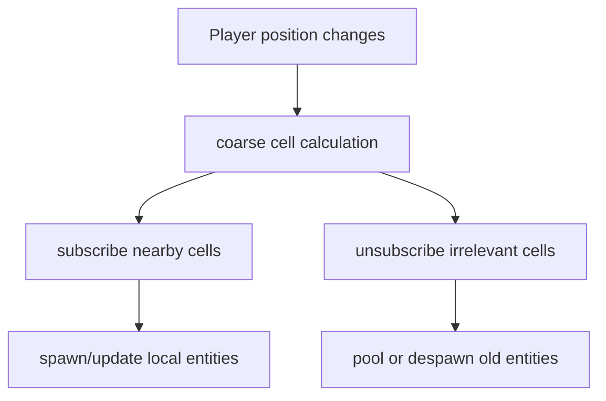

# Technical Architecture

> Back to [VRMMO_INDEX.md](VRMMO_INDEX.md)  
> Master blueprint: [VRMMO_DESIGN_BLUEPRINT.md](VRMMO_DESIGN_BLUEPRINT.md)

## Target Stack

- Unreal Engine 5.7.
- SpacetimeDB for authoritative persistence, reducers, and subscriptions.
- C++ for core runtime systems.
- Blueprints for interaction, UI, animation orchestration, and rapid gameplay iteration.

## Source-Of-Truth Split

| State Type | Example | Owner |
|---|---|---|
| Persistent authoritative state | character, inventory, spellstones, quest state | SpacetimeDB |
| Area-relevant state | nearby entities, combat events, local chat | SpacetimeDB subscriptions |
| High-frequency motion | head, hands, weapon pose | client prediction and compressed updates |
| Visual-only feedback | trails, previews, local book animation | client |
| Server-validated actions | cast, stance art, trade, equip | authoritative reducers / server logic |

## Interest Management

Clients should subscribe to nearby gameplay cells and personal state, not the whole realm.

## Blueprint And C++ Split

| System | Blueprint | C++ |
|---|---:|---:|
| Cardinal UI animation | yes | optional |
| Glove vial visuals | yes | data source |
| Spellbook interactions | yes | spell ownership and validation |
| Melee stance feedback | yes | final recognition |
| Ranged trajectory preview | yes | math and validation likely C++ |
| SpacetimeDB integration | wrapper calls only | yes |
| entity pooling | no | yes |
| remote avatar smoothing | no | yes |
| HLOD tooling | no | yes |

## Blueprint Risk Rules

Avoid:

- heavy Event Tick use.
- GetAllActorsOfClass in gameplay.
- large ForEach loops.
- per-frame UI binding.
- spawn/destroy bursts.
- direct SpacetimeDB subscription logic scattered across many Blueprints.

Prefer:

- C++ subsystems.
- Blueprint-callable safe APIs.
- event-driven Blueprints.
- pooled actors.
- profiler-driven conversion from Blueprint to C++.

