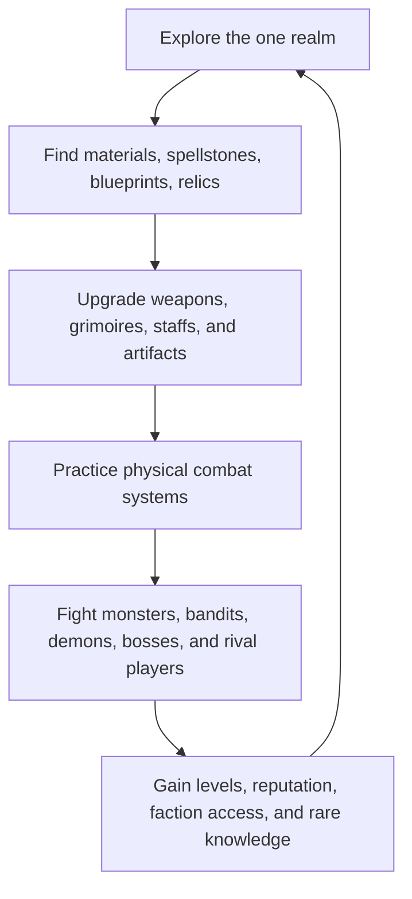
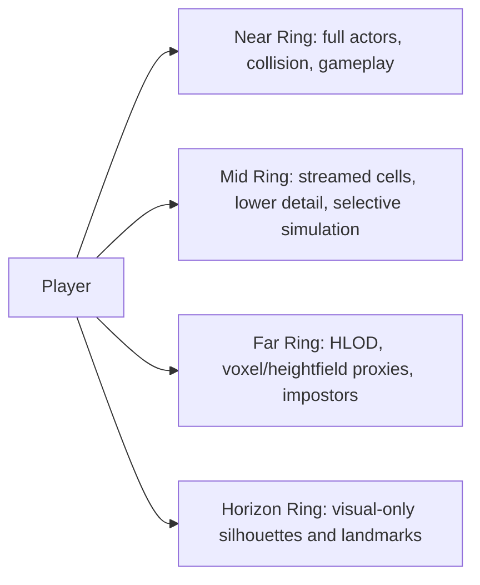
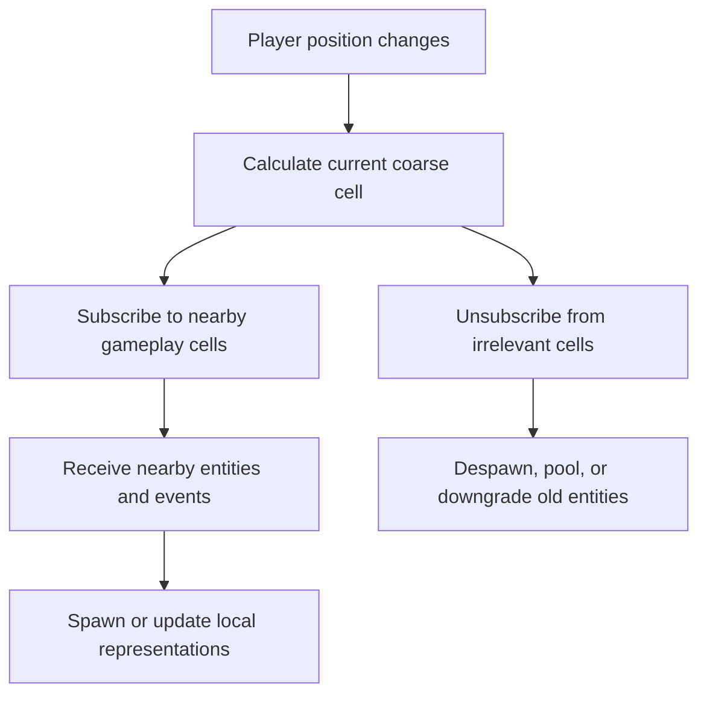
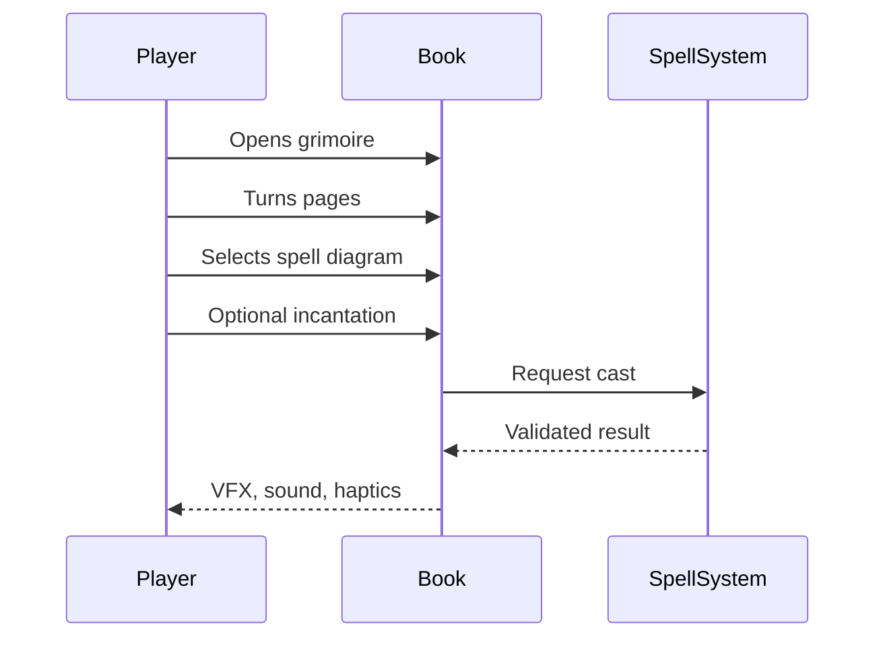
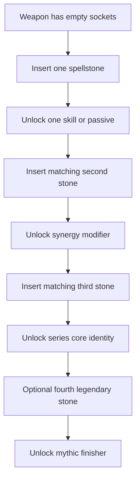
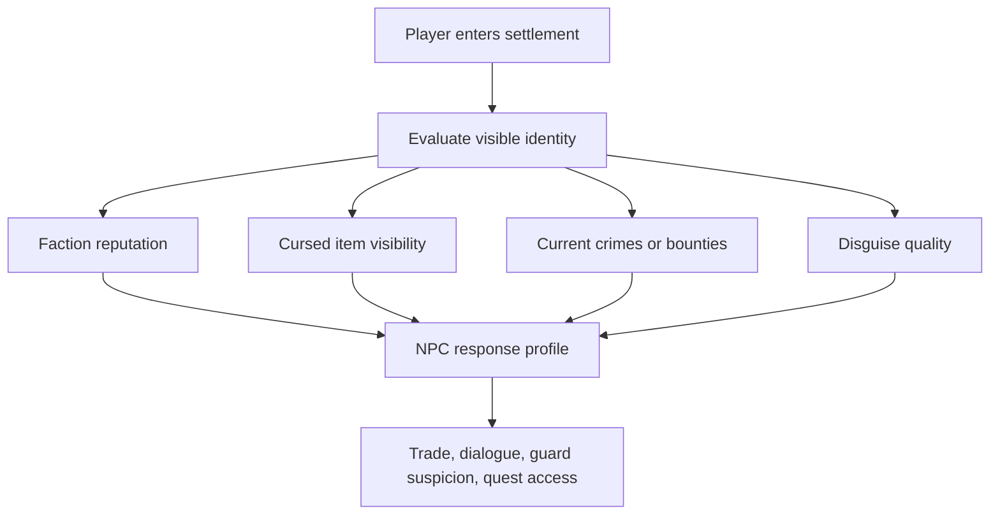

# VRMMO Design Blueprint

> Last updated: 2026-05-05  
> Working title: TBD  
> Target stack: Unreal Engine 5.7, SpacetimeDB, VR-first interaction design  
> Core ambition: A seamless, large-scale, one-realm VRMMO where world scale, physical mastery, social consequence, and magical itemization all matter.

---

## 1. Executive Summary

This project is a VR-first MMO designed around embodied interaction instead of flat hotbars. The player should feel small inside a vast fantasy world, but still powerful through skill, craft, and mastery.

The core design direction combines:

- A massive one-realm world using aggressive world streaming, HLOD, Nanite, and far-distance proxy rendering.
- Physical ability systems where spells, sword arts, and item powers are activated through books, stances, weapons, voice, and body position.
- A diegetic resource and interface layer built around the player's glove, hanging vial charms, and cardinal familiar.
- A buildcraft system based on weapon type, stance slots, spellstones, crafted materials, grimoires, staffs, and rare artifacts.
- Socially meaningful cursed items, especially demon eyes, which grant powerful abilities but change how societies treat the player.
- SpacetimeDB as the authoritative world-state and persistence layer, with careful interest management so clients only receive relevant nearby state.

The design goal is not to simulate everything everywhere at full fidelity. The goal is to create the feeling of one living, overwhelming realm while only fully simulating the small slice of the world that matters to each player.

### 1.1 Linked Design Documents

The master blueprint is supported by focused topic documents:

| Topic | Document |
|---|---|
| Document hub | [VRMMO_INDEX.md](VRMMO_INDEX.md) |
| World and rendering | [WORLD_AND_RENDERING.md](WORLD_AND_RENDERING.md) |
| Technical architecture | [TECHNICAL_ARCHITECTURE.md](TECHNICAL_ARCHITECTURE.md) |
| Diegetic UI, cardinal familiar, and resource vials | [DIEGETIC_UI_CARDINAL_AND_VITAE.md](DIEGETIC_UI_CARDINAL_AND_VITAE.md) |
| Magic combat | [COMBAT_MAGIC.md](COMBAT_MAGIC.md) |
| Melee combat | [COMBAT_MELEE.md](COMBAT_MELEE.md) |
| Ranged combat | [COMBAT_RANGED.md](COMBAT_RANGED.md) |
| Items, spellstones, and crafting | [ITEMIZATION_SPELLSTONES_AND_CRAFTING.md](ITEMIZATION_SPELLSTONES_AND_CRAFTING.md) |
| Demon eyes and social consequence | [DEMON_EYES_AND_REPUTATION.md](DEMON_EYES_AND_REPUTATION.md) |
| Progression, balance, and roadmap | [PROGRESSION_BALANCE_AND_ROADMAP.md](PROGRESSION_BALANCE_AND_ROADMAP.md) |

---

## 2. Design Pillars

| Pillar | Meaning | Practical Rule |
|---|---|---|
| Embodied mastery | Abilities come from physical actions, not hotbars | Books, stances, grips, gestures, and eye control should replace menu-heavy combat |
| Overwhelming scale | The world must feel enormous from high viewpoints | Far terrain, cities, forests, mountains, and landmarks must remain visible far beyond gameplay range |
| Build identity | Gear should change how a player fights, not only raise stats | Spellstones, crafted weapons, demon eyes, and stances define playstyle |
| Consequence | Power has social and physical costs | Curses, factions, suspicion, concealment, and reputation matter |
| Diegetic presence | The game interface should feel like an object in the world | Gloves, vials, familiars, books, maps, and lenses replace flat panels |
| Performance realism | Scale is an illusion built from layers | Full simulation is local; distant world state becomes cheaper representations |
| Learnable depth | New players start simple, mastery unfolds over time | Start with few stance slots and spell options, then unlock advanced layers |

---

## 3. High-Level Game Loop



The game loop should support multiple player fantasies:

- Adventurer: explores ruins, finds spellstones, hunts rare beasts.
- Warrior: masters stance-based weapon arts.
- Mage: studies grimoires, staffs, incantations, and spell rings.
- Archer / Ranger: masters quivers, trajectory, battlefield arrows, and recall timing.
- Crafter: travels to dwarven realms, collects blueprints, creates legendary weapons.
- Cursed power seeker: uses demon eyes and forbidden relics despite social consequences.
- Trader: profits from rare materials, spellstone series, custom weapon commissions, and realm-specific goods.

---

## 4. World Vision

### 4.1 One-Realm Structure

The world should feel like one continuous realm rather than disconnected MMO zones. This does not mean every region is fully loaded or simulated at all times. It means the player should experience continuity:

- Distant mountain ranges should remain visible.
- Large cities, divine trees, floating structures, demon towers, and realm gates should be visible from far away.
- Travel should feel physical and spatial.
- Region transitions should be hidden through terrain, gates, caves, ocean routes, magical fog, or large traversal paths.

### 4.2 Realm Concepts

| Realm / Region | Function | Design Notes |
|---|---|---|
| Human / Overworld Realm | Early and mid-game society, basic trade, common weapons, entry-level magic | Most socially strict toward demon eyes and cursed items |
| Dwarf Realm | Advanced crafting, weapon blueprints, legendary forge access | Key destination for high-grade weapons and multi-slot spellstone gear |
| Demon Nation / Demon Lands | Forbidden power, demon eyes, cursed relics, dangerous alliances | Demons may respect or fear marked players instead of rejecting them |
| Bandit Territories | Black market, smuggling, cursed-item trade | Bandits may treat demon-eye users as dangerous or impressive |
| Ancient Ruins | Spellstone discovery, lost weapon series, grimoire pages | Good source of exploration-driven progression |
| Wild Frontier | Rare materials, world bosses, giant landscape scale | Supports the "overwhelmed by scale" fantasy |

---

## 5. Rendering And World Scale Strategy

### 5.1 Core Rendering Philosophy

The world should be rendered in nested detail rings. Minecraft-style chunk loading is a useful starting idea, but the target should be closer to a high-distance proxy system like Voxy-style distant terrain, paired with Unreal World Partition and HLOD.



### 5.2 Distance Rings

| Ring | Approximate Range | What It Contains | Implementation Direction |
|---|---:|---|---|
| Near | 0-200 m | Full actors, collision, interactables, enemies, nearby players | World Partition cells, normal actors, high update rate |
| Mid | 200 m-1.5 km | Terrain, structures, selected AI, lower-detail players | HLOD, reduced actor tick, selective collision |
| Far | 1.5-16 km+ | Mountains, forests, cities, ruins, giant silhouettes | Custom HLOD actors, voxelized terrain proxies, baked materials |
| Horizon | 16 km+ | Mythic scale signals only | Static distant meshes, skybox elements, landmark impostors |

### 5.3 Unreal 5.7 Feature Usage

| Feature | Use | Risk |
|---|---|---|
| World Partition | Main world streaming system | Requires careful grid design and content discipline |
| HLOD | Distant unloaded cell representation | Automatic HLOD may not be enough for the desired world scale |
| Custom HLOD Actors | Inject custom far-world proxy logic | Requires custom engineering |
| Nanite | Static meshes, cliffs, buildings, rocks, dense set dressing | Does not remove need for material, shadow, and draw-call discipline |
| Nanite Foliage / Nanite Voxels | Large foliage fields and tree distance rendering | Experimental in UE 5.7, needs profiling |
| Lumen | Beautiful lighting for non-VR or high-end targets | VR path must be tested carefully |
| PCG | Biome and prop generation | Generation must produce streamable, optimized content |

### 5.4 Performance Principles

- The player should see much farther than they can interact.
- Distant entities should become symbols, silhouettes, crowds, or aggregate markers.
- Do not replicate or simulate every distant actor.
- Shadows, foliage, skeletal meshes, materials, and VR stereo rendering are likely to become larger problems than triangle count.
- Use Unreal Insights early and continuously.
- Build a test map before building the final world.

### 5.5 First Rendering Prototype

The first prototype should answer one question:

> Can a player stand on a high hill in VR, look across an enormous landscape, and maintain comfortable frame time while only the nearby world is fully interactive?

Suggested prototype:

- 8 km or 16 km square landscape.
- One forest biome.
- One city or castle visible from far away.
- One mountain range or giant world landmark.
- World Partition enabled.
- HLOD enabled.
- Custom far-world proxy layer.
- Nanite foliage test patch.
- 100, 500, and 1,000 simulated remote players for network/render stress tests.

---

## 6. Networking And SpacetimeDB Architecture

### 6.1 Source-Of-Truth Split

SpacetimeDB should be the authoritative database and reducer layer, but it should not be treated as a raw high-frequency motion bus.

| State Type | Example | Owner |
|---|---|---|
| Persistent authoritative state | character, inventory, spellstones, quest state, reputation | SpacetimeDB |
| Area-relevant state | nearby entities, local events, combat state | SpacetimeDB subscriptions with interest filtering |
| High-frequency local motion | VR head, hands, weapon pose | Local client prediction plus compressed network updates |
| Visual-only feedback | local weapon trails, book page animation, spell targeting preview | Client |
| Server-validated actions | cast spell, execute sword art, trade, equip item | SpacetimeDB reducers / authoritative server logic |

### 6.2 Interest Management



The client should subscribe to:

- Nearby player entities.
- Nearby enemy entities.
- Local combat events.
- Local chat.
- Active world events in the relevant region.
- Personal inventory, equipment, spellstones, quest state, and reputation.

The client should not subscribe to:

- Every player in the realm.
- Every AI.
- Every market listing unless a market UI is open.
- Every transform update globally.
- Full distant battle state unless the player is close enough to matter.

### 6.3 Suggested Data Domains

| Domain | Tables / Systems |
|---|---|
| Identity | player, character, account flags |
| Position | entity transform, coarse cell presence |
| Combat | health, status effects, active cast, cooldowns |
| Inventory | items, equipped gear, spellstones, materials |
| Crafting | blueprints, recipes, forge jobs, custom weapon metadata |
| Reputation | faction standing, crime flags, cursed-item suspicion |
| Social | party, guild, local chat, trade offers |
| World | region events, boss state, resource node state |

---

## 7. Blueprint And C++ Strategy

Blueprints should be used heavily for prototyping, UI, animation orchestration, interaction flow, and designer-facing content. C++ should own performance-critical and authoritative systems.

### 7.1 Recommended Split

| System | Blueprint | C++ |
|---|---:|---:|
| Wrist compass UI | yes | optional helper math |
| Map book interaction | yes | map data, streaming, marker queries |
| Spellbook page turning | yes | spell ownership, validation |
| Combat spell ring | yes | cast authority, cooldowns, targeting rules |
| Sword stance feedback | yes | final stance recognition |
| Gesture recognition prototype | yes | final high-frequency recognition |
| SpacetimeDB integration | limited wrapper calls | yes |
| Entity pooling | no | yes |
| Remote avatar smoothing | no | yes |
| HLOD tooling | no | yes |

### 7.2 Blueprint Rule

Blueprint is safe for event-driven interaction. C++ is preferred for anything that runs every frame, loops over many entities, or affects authoritative game state.

Dangerous Blueprint patterns:

- Heavy Event Tick usage.
- GetAllActorsOfClass in gameplay.
- Large ForEach loops.
- Per-frame distance checks over many actors.
- Per-frame UI binding.
- Spawn/destroy bursts instead of pooling.
- Direct network subscription logic scattered across many Blueprints.

---

## 8. Diegetic UI Direction

The interface should live inside the world as much as possible.

| UI Need | Diegetic Form | Notes |
|---|---|---|
| Compass | Wrist compass | Low update rate is fine |
| Map | Physical map book | Pages, markers, zoom lenses, hand-drawn region detail |
| Spell selection | Grimoire / spellbook | Page turning for study casting, floating page ring for combat |
| Skill activation | Weapon stance | No hotbar for melee skills |
| Inventory | Satchel, belt, chest, book, or magic pouch | Keep fast combat access limited |
| System menu | Cardinal familiar pocket space | Settings, logout, party, social, comfort, and meta interface |
| Health / Vitae | Glove-mounted hanging vial charms | Red and blue liquid charms visible on the wrist |
| Reputation / suspicion | NPC reactions and guard behavior | Avoid making everything a flat status meter |

### 8.1 Cardinal Familiar Interface

The cardinal familiar is the player's main non-combat interface anchor. It solves a difficult VR problem: the game needs settings, logout, party management, skill inspection, and system options, but the world should avoid flat floating UI panels.

Two access methods should exist:

| Access Method | Flow | Purpose |
|---|---|---|
| Quick access | controller menu button, cardinal flies across the player's view, transition into pocket UI | fast settings, comfort, logout, emergency access |
| Immersive access | extend arm, cardinal lands on wrist, player looks into its eye, transition into pocket UI | roleplay-friendly access to deeper menus |

Other players should see a shadow, phantom, or faint resting projection when a player is in the pocket UI scene. This preserves world presence and avoids making the player simply disappear.

The cardinal can provide:

- settings and logout.
- party invites and social notifications.
- map and quest access.
- skillstone inspection.
- trade notifications and mail.
- tutorial hints.
- scout reports.
- comfort options.

The pocket UI should feel like a small magical space rather than a normal pause menu. It can be the one controlled exception to the "no out-of-world UI" rule because it is justified as a familiar-mediated inner space.

### 8.2 Skillstone Inspection

Spellstones, skillstones, and similar magical stones should show class-specific visions when inspected through the cardinal interface or held close to the player.

Example:

```text
Storm Stone

Mage sees: lightning ritual and spell circle
Warrior sees: lightning blade stance and slash release
Archer sees: lightning arrow, chain shot, and recall path
```

This lets the same item exist in the economy while different combat paths interpret it through their own discipline.

### 8.3 Glove Vials For Health And Vitae

The player receives a glove early in the game that acts as a diegetic status interface. Small glass vials hang from the wrist on chains, similar in feeling to physical charms or feathers moving from the player's body.

| Vial | Resource | Visual Language |
|---|---|---|
| Red vial | health / blood vitality | red liquid, pulsing glow, cracks or flicker at critical health |
| Blue vial | Vitae / life force | blue liquid, sparkles, dimming or desaturation at low levels |

The vials should be glance-readable in VR:

- liquid level clearly drops and rises.
- liquid glow shows fullness.
- bubbles or sparks show regeneration.
- chains sway subtly with movement.
- the red vial pulses or cracks visually at low health.
- the blue vial dims when low on Vitae.
- nearby healing can make the red cork or chain glow.
- curses, poison, or soul effects can fog or discolor the liquid.

The glove should default to the right wrist, but players should be able to switch wrists or adjust visibility in settings.

### 8.4 Vitae Resource System

Vitae, Life Force, Aether, Spirit, Essence, and Vital Energy are candidate names for the shared non-health resource. The preferred working names are Vitae or Life Force.

Vitae should be shared across classes so party resource sharing becomes useful:

| Class Path | Vitae Use |
|---|---|
| Mage | spells, healing, rituals, shields, grimoire techniques |
| Warrior | enhanced stance arts, counters, spellstone sword skills |
| Archer | special arrows, recall effects, eagle eye, trajectory sight |
| Cursed artifact user | demon eye abilities, curse suppression, forbidden powers |

This allows a warrior or archer who uses less Vitae to give potions to a mage before a healing or defensive phase.

Vitae should remain separate from health, but certain builds can convert one into the other:

- priests spend Vitae to restore health.
- blood magic spends health to restore Vitae or empower spells.
- demon eyes may drain health or Vitae for forbidden effects.
- warriors may spend Vitae on signature arts.
- archers may spend Vitae on scout vision and magical recall.

### 8.5 Resource Feedback

Avoid requiring the player to stare at flat bars. Use layered feedback:

| State | Diegetic Feedback | Screen / Sensory Feedback |
|---|---|---|
| low health | red vial pulses, cracks, liquid shakes | soft red edge pulse, heartbeat, muffled impact audio |
| critical health | red vial sputters or darkens | stronger red vignette, heavy breathing |
| low Vitae | blue vial dims, spellstones lose brightness | mild desaturation, reduced magical particles |
| critical Vitae | blue liquid goes pale or nearly clear | stronger black-white desaturation, quieter magical audio |

VR comfort rule: strong screen tinting and desaturation should be reserved for extreme states, not normal low-resource play.

---

## 9. Magic System

### 9.1 Mage Equipment Roles

| Item | Role |
|---|---|
| Grimoire / Spellbook | Spell knowledge, spell selection, ritual casting |
| Staff / Wand | Spell aiming, shaping, and delivery |
| Spellstones | Modular magical abilities and series powers |
| Robes / Focus items | Mana, cooldown, channel stability, school bonuses |

### 9.2 Study Casting

Study casting is slower and more flavorful.

Flow:



Best uses:

- Ritual magic.
- Teleport preparation.
- Buffs.
- Utility spells.
- Crafting or enchanting.
- Puzzle spells.
- Exploration tools.

### 9.3 Combat Casting

Combat casting uses the book as a physical spell interface.

Flow:

1. Player grips the grimoire.
2. Player throws or releases it forward.
3. Book anchors in front of the player.
4. Pages separate into a circular spell ring.
5. Player hovers hand, staff, or wand over a spell page.
6. Selected spell charges.
7. Player casts using staff, wand, hand release, gesture, or optional incantation.
8. Ring collapses and book returns to hand, hip, or orbit position.

### 9.4 Incantations

Incantations should be optional, expressive, and not required for normal combat.

| Result | Effect |
|---|---|
| No incantation | Normal cast |
| Correct incantation | Bonus potency, faster charge, lower cost, or special modifier |
| Partial incantation | Small bonus or unstable visual |
| Incorrect incantation | No bonus, fizzled modifier, or harmless instability |

Accessibility note: voice should never be mandatory for core combat.

---

## 10. Melee System

### 10.1 Core Idea

Melee abilities are activated by weapon stance, grip, hold duration, and release motion. This creates physical combat mastery instead of hotbar rotation.


### 10.2 Stance Layers

| Progression Stage | Stance Access | Design Role |
|---|---|---|
| Novice | 4 one-handed stances | Learnable early combat |
| Adept | 4 two-handed stances | More powerful committed skills |
| Expert | stance chains | Skill expression and combos |
| Master | cancels, counters, signature arts | High mastery ceiling |

### 10.3 Example One-Handed Stances

| Stance | Example Skill Type |
|---|---|
| High guard | overhead slash, wind slash |
| Low guard | rising slash, draw cut |
| Side guard | sweeping cut, cleave |
| Forward point | thrust, dash pierce |

### 10.4 Example Two-Handed Stances

| Stance | Example Skill Type |
|---|---|
| Two-hand overhead | charged crescent wave, heavy cleave |
| Two-hand low draw | iai-style slash, shock cut |
| Two-hand forward guard | linebreaker thrust, barrier pierce |
| Two-hand side charge | spinning cut, wide arc slash |

### 10.5 Weapon Identity

| Weapon | Combat Flavor |
|---|---|
| Longsword | balanced slashes, counters, light beams |
| Greatsword | slower stance commitment, huge arcs, charged cuts |
| Spear | thrusts, lunges, range control, piercing lines |
| Hammer | slams, shockwaves, armor breaks |
| Daggers | dual-hand combos, rapid cuts, evasive skills |
| Shield | guard angle, bashes, parries, protective zones |
| Axe | hooks, cleaves, bleed effects, guard breaking |

### 10.6 Recognition Design

The stance system should be forgiving:

- Use broad pose zones rather than exact poses.
- Track weapon relative to head, chest, hips, and dominant hand.
- Check weapon angle, grip state, hand separation, and hold duration.
- Give strong feedback when a stance is recognized.
- Do not require perfect posture.

Feedback cues:

- Haptic pulse when stance is recognized.
- Blade glow when a skill is charging.
- Element aura when spellstone power is active.
- Ghost arc showing release direction.
- Audio cue when skill is ready.

---

## 11. Ranged System

### 11.1 Core Idea

Ranged combat should follow the same physical design language as magic and melee. The archer should not feel like they are pressing ranged hotkeys. They should feel like they are choosing arrow sources, draw forms, trajectories, and recall timing.


The ranged fantasy is:

> Archers commit arrows into the battlefield, shape the fight through trajectory, then choose the perfect moment to recall their shots.

### 11.2 Equipment Roles

| Item | Role |
|---|---|
| Bow | fast, expressive, draw-form based ranged combat |
| Crossbow | slower, heavier, precise, bolt-based power shots |
| Back quiver | primary combat arrows |
| Left hip quiver | utility and control arrows |
| Right hip quiver | heavy, magical, or armor-breaking arrows |
| Bow crystal / recall focus | recalls fired arrows or bolts |
| Range vision focus | shows curved paths, landing zones, scouting marks, and long-range visibility |
| Arrowheads | damage type, armor interaction, special payload |
| Fletching | accuracy, stealth, wind correction, curve behavior |
| Rune shaft | magical channel, recall effect, elemental compatibility |

### 11.3 Quiver Skill Families

The three-quiver concept gives ranged players a physical loadout system.

| Quiver | Role | Example Skills |
|---|---|---|
| Back quiver | core combat | quick shot, power shot, pierce shot, mark shot |
| Left hip quiver | utility / control | smoke volley, rope arrow, flare, binding shot, silence arrow |
| Right hip quiver | heavy / magical | lightning pierce, dragonbone breaker, explosive arrow, boss-breaker shot |

Suggested progression:

| Stage | Quiver Access | Design Role |
|---|---|---|
| Novice | back quiver only | learn aim, draw, and recall |
| Adept | left hip quiver | utility and battlefield control |
| Expert | right hip quiver | heavy magical arrows and boss tools |
| Master | quiver chaining | combine utility, power, recall paths, and trick shots |

### 11.4 Draw Forms

Draw forms are the archer equivalent of melee stances.

| Draw Form | Activation | Skill Fantasy |
|---|---|---|
| Full draw | hold to high tension | power shot, piercing shot |
| Snap draw | quick pull and release | fast shot, interrupt shot |
| High arc | aim above target | volley, rain shot, smoke field |
| Ground aim | aim into terrain | tunneling arrow, trap arrow, root burst |
| Held mark | hold aim on target | binding shot, weak-point shot |
| Side draw | angled bow posture | evasive shot, curve shot |
| Double nock | grab and fire two arrows | split shot, twin bind |
| Overdraw | pull beyond normal safe tension | risky high-damage breaker shot |

### 11.5 Example Skill Combinations

| Input Combination | Result |
|---|---|
| Back quiver + full draw | Power Shot |
| Back quiver + snap draw | Quick Shot |
| Left quiver + high arc | Smoke Volley |
| Left quiver + held mark | Binding Shot |
| Right quiver + full draw | Lightning Pierce |
| Right quiver + overdraw | Dragonbone Breaker |
| Left quiver + ground aim | Root Snare |
| Right quiver + high arc | Storm Rain |
| Back quiver + wall angle | Ricochet Shot |
| Any quiver + recall through enemies | Return Path Damage |

### 11.6 Trajectory-Based Targeting

Ranged combat should reward reading space and terrain.

| Trajectory | Preview | Example Uses |
|---|---|---|
| Direct line | thin aim line | normal shots, pierce, weak-point hits |
| High arc | landing circle | volleys, smoke fields, flare rain, storm arrows |
| Ground shot | underground path | tunneling arrows, spikes, traps, root bursts |
| Wall shot | bounce line | ricochet, corner shots, trick shots |
| Past-target shot | recall line | fire behind enemies, then recall through them |
| Curved shot | bending path thread | shoot around shields, walls, terrain, or cover |

The targeting preview should be diegetic and subtle:

- High arc shows a faint landing circle.
- Tunneling arrows show a glowing underground path.
- Ricochet arrows show predicted bounce lines.
- Curving arrows show a range vision path that bends with the weapon's rotation.
- Binding arrows show tether previews.
- Recallable arrows pulse faintly in the world.
- Recall shows thin light threads from bow crystal to arrows.

### 11.7 Curving Shots And Range Vision

Curving shots are unlocked ranged techniques that let the player bend arrows or bolts by angling and rotating the bow or crossbow before release.

The interaction should feel physical:

```text
normal aim = straight shot
roll bow left = curve left
roll bow right = curve right
tilt upward = lofted curve
tilt downward = dipping shot
longer hold = clearer range vision preview
```

The preview can be called Range Vision, Archer's Thread, Eagle Thread, Trajectory Sight, or Fate Line. It should appear as a subtle spectral thread rather than a flat UI laser unless the weapon's style is explicitly mechanical or magical.

Curving shot uses:

- shooting around corners.
- bending around shields.
- hitting weak points from unusual angles.
- firing behind a target before recalling through them.
- threading arrows through ruins, trees, windows, or battlefield clutter.
- creating party openings by striking protected enemies.

Balance rules:

- stronger curves reduce speed, damage, or armor penetration.
- heavy bolts curve less than light arrows.
- crossbows may need special limbs, runes, or bolts to curve well.
- range vision should cost Vitae or require a skillstone for advanced bends.
- enemies should receive subtle magical tells for strong curve shots.

### 11.8 Eagle Eye And Scout Role

Ranged players should have a party role beyond damage. Eagle Eye, Sniper's Vision, or Scout Sight lets archers inspect distant terrain, identify threats, and mark opportunities for the group.

Possible scout abilities:

| Ability | Function | Party Value |
|---|---|---|
| Eagle Eye | stabilized zoom or distant terrain lens | scout routes, camps, bosses, and landmarks |
| Weakpoint Mark | highlights armor gaps or vulnerable spots | enables burst windows for melee and magic |
| Trail Sight | reveals footprints, monster paths, or recent movement | tracking and ambush prevention |
| Wind Read | shows wind drift and projectile difficulty | improves long-range shots and storm navigation |
| Watchpoint | places a temporary party-visible mark | team coordination |
| Survey Pulse | reveals nearby resource nodes or hidden paths | exploration and gathering |

VR comfort rule: avoid hard full-screen zoom when possible. Prefer a stabilized circular lens, bow-crystal scope, spyglass attachment, or cardinal-assisted scouting view.

Party synergy example:

```text
Archer marks weakpoint
Melee fighter breaks guard
Mage prepares burst spell
Archer curves shot behind target
Archer recalls arrows through exposed line
```

This gives parties a reason to value ranged players without making solo play impossible.

### 11.9 Recall Ammo System

Arrows and bolts should remain where they land until recalled by the player. The player holds or charges a crystal on the bow or crossbow, then fired ammo returns to the quiver like a magical retrieval stream.

This creates a strong resource loop:

```text
fire arrows
commit ammo into the battlefield
fight with limited remaining shots
choose a safe recall moment
arrows return through space
quiver refills
```

The real resource is not permanent ammo loss. The real resource is:

- arrows currently deployed.
- recall timing.
- recall vulnerability.
- quiver capacity.
- special arrow cooldowns.
- battlefield position.

### 11.10 Recall Types

| Recall Type | Behavior | Tradeoff |
|---|---|---|
| Quick recall | arrows return quickly | weaker, easier to interrupt |
| Charged recall | hold crystal longer | safer, stronger, more visible |
| Silent recall | arrows return quietly | slower, stealth-focused |
| Violent recall | arrows damage enemies on return path | higher cooldown or resource cost |
| Anchor recall | arrows remain active as traps until recalled | fewer arrows available while traps are active |
| Scatter recall | arrows return in curved paths | harder to aim but can hit multiple enemies |

### 11.11 Bow And Crossbow Identity

| Weapon | Identity |
|---|---|
| Bow | faster, expressive, draw-form focused, strong trajectory control |
| Longbow | slower, longer draw, strong range and high-arc attacks |
| Shortbow | fast, mobile, weaker per shot, excellent snap draw |
| Warbow | heavy draw, armor piercing, stamina intensive |
| Crossbow | precise, slower reload, strong bolts and trap tools |
| Repeating crossbow | lower damage per bolt, burst fire, mechanical reload rhythm |
| Arbalest | very slow, extreme armor break, siege or boss role |

### 11.12 Spellstone And Recall Effects

Spellstones should modify both outgoing shots and returning arrows.

| Series | Shot Effect | Recall Effect |
|---|---|---|
| Storm | lightning pierce, chain shots | arrows chain lightning on return |
| Blood | bleeding shots, life marks | returning arrows lifesteal |
| Earth | tunneling arrows, stone spikes | arrows erupt before returning |
| Shadow | silent shots, blind zones | arrows vanish and return quietly |
| Sun | radiant flare, holy pierce | return paths burn lines of light |
| Frost | slowing shots, ice traps | return paths leave frost trails |
| Gravity | heavy shots, pull fields | arrows pull enemies inward on recall |
| Demonbone | curse pierce, fear mark | return paths apply dread or corruption |

### 11.13 Balance Rules

- Do not make every special arrow a permanent consumable.
- Use recoverable ammo for the core loop.
- Use cooldowns, stamina, focus, or quiver capacity for combat pacing.
- Reserve rare consumable arrows for special encounters or crafted advantages.
- Make recall powerful but interruptible or timing-sensitive.
- Ensure ranged players need positioning, not only aim.
- Keep previews clear without turning the world into a flat UI overlay.

---

## 12. Weapon And Spellstone Progression

### 12.1 Weapon Progression

Players begin with standard weapons such as a longsword, greatsword, spear, hammer, dagger, shield, axe, staff, or wand. Early weapons support basic human techniques and limited customization.

Advanced progression introduces:

- Higher-grade weapons.
- Spellstone sockets.
- Custom dwarven forging.
- Material-driven traits.
- Blueprint-based weapon designs.
- Legendary weapons with four or more spellstone slots.

### 12.2 Spellstone System

Spellstones are modular magical ability stones that can be found, traded, purchased, won, crafted, or earned.

| Source | Design Role |
|---|---|
| Loot | Exploration and combat rewards |
| Trade | Player economy |
| Purchase | Merchant progression |
| Tournaments | Prestige and PvP reward |
| Quest lines | Lore-tied unlocks |
| Ruins | Ancient or forbidden series |
| Bosses | Rare series pieces |

### 12.3 Spellstone Series

Most spellstone series contain three stones. Rare series contain four or more, allowing legendary weapons to complete full mythic sets.

Example series:

| Series | Stone Count | Theme |
|---|---:|---|
| Excalibur Series | 4 | radiant sword arts, holy beams, kingly authority |
| Blood Series | 3-4 | lifesteal, blood marks, self-sacrifice, crimson burst |
| Storm Series | 3 | speed, lightning, chaining attacks |
| Earthbreaker Series | 3 | hammer slams, armor break, terrain rupture |
| Moonveil Series | 3 | illusion cuts, afterimages, silent movement |
| Abyss Series | 4 | cursed damage, void pull, sanity risk |
| Phoenix Series | 4 | fire, revival, burst healing, rebirth cooldown |

### 12.4 Series Completion

Completing a spellstone series should unlock a defining playstyle.



### 12.5 Dwarven Crafting

The dwarf realm should be the center of advanced weapon crafting.

Crafting ingredients:

- Weapon blueprint.
- Core material.
- Edge or head material.
- Grip or shaft material.
- Rune channel.
- Spellstone socket design.
- Blacksmith skill or forge quality.
- Optional rare catalyst.

Weapon attributes:

| Attribute | Effect |
|---|---|
| Length | reach, handling, close-space weakness |
| Weight | stamina cost, impact, swing speed |
| Balance | recovery, stance stability |
| Material | durability, spell compatibility |
| Socket count | spellstone capacity |
| Socket alignment | which series or elements fit best |
| Rune channeling | cooldown, mana cost, charge speed |

Important design rule: A four-slot weapon should not automatically be best for every build. Slot alignment and material compatibility should matter.

---

## 13. Demon Eye System

### 13.1 Core Fantasy

Demon eyes are rare, powerful, socially dangerous artifacts. They grant passives and activated abilities, but most human societies fear or reject anyone visibly marked by one.

The core VR mechanic:

> The player closes one eye to activate the demon eye's special ability, gaining power while partially losing vision.

This is a strong VR-native tradeoff because the player physically experiences the cost.

### 13.2 Social Consequences

| Society / Group | Reaction To Visible Demon Eye |
|---|---|
| Human civilians | fear, avoidance, refusal to speak |
| Merchants | refuse trade, overcharge, or call guards |
| Guards | suspicion, following, arrest for minor offenses |
| Priests / holy orders | refusal to heal, hostility, cleansing quests |
| Bandits | respect, fear, black-market access |
| Demons | admiration, curiosity, fear, or faction interest |
| Dwarves | pragmatic suspicion, may trade if paid or vouched for |

Example consequence:

If a visible demon-eye user bumps into a citizen and a guard sees it, the guard may arrest the player or demand a fine. A normal player might receive a warning for the same action.

### 13.3 Concealment

Players need tools to manage the curse.

| Concealment | Benefit | Cost |
|---|---|---|
| Eyepatch | hides eye reliably | reduces vision in that eye |
| Monocle illusion | hides appearance while preserving some sight | can fail under inspection or magic scan |
| Hood / mask | helps in crowds | suspicious in guarded areas |
| Glamour charm | magically hides the mark | limited duration or expensive upkeep |
| Demon disguise | safe in demon lands | dangerous in human cities |

### 13.4 Vision And Accessibility

Because this is VR, fully blinding one eye may be uncomfortable for some players. Provide visual comfort options while keeping the gameplay tradeoff.

| Mode | Visual Effect |
|---|---|
| Immersive | one eye fully occluded |
| Comfort | dark vignette, blur, or reduced contrast |
| Minimal | subtle overlay plus mechanical accuracy penalty |

The game should preserve the design cost without making players physically uncomfortable.

### 13.5 Example Demon Eyes

| Demon Eye | Passive | Activated Ability | Cost |
|---|---|---|---|
| Eye of Sith Sense | faint danger intuition | see enemy weak points | one-eye vision loss while active |
| Eye of Wrath | intimidation aura | double damage for short window | defense reduction, social fear |
| Eye of Blood Echo | track wounded enemies | reveal blood trails and lifeforce | health drain over time |
| Eye of Chains | resistance to fear | bind a target briefly | movement slowdown |
| Eye of Ash | fire resistance | mark enemies for burning detonation | water/holy vulnerability |
| Eye of the Abyss | void affinity | see hidden entities or rifts | sanity distortion, NPC terror |

---

## 14. Reputation, Crime, And Social Reaction

Social systems should react to visible equipment, faction standing, crimes, and public behavior.



NPC reaction should not be binary. Use suspicion levels:

| Suspicion Level | Behavior |
|---|---|
| 0 | normal |
| 1 | nervous dialogue, higher prices |
| 2 | merchant refusal, guards watch |
| 3 | guards follow, citizens flee |
| 4 | search, demand explanation, fine |
| 5 | arrest, attack, or expulsion |

This creates room for disguises, bribes, faction permits, reputation, and player choice.

---

## 15. Itemization Model

### 15.1 Equipment Slots

Suggested high-level slots:

- Main hand weapon.
- Off hand weapon or shield.
- Grimoire.
- Staff or wand.
- Head.
- Chest.
- Hands.
- Legs.
- Feet.
- Trinkets.
- Eye slot / cursed artifact slot.
- Belt quick-access slots.

### 15.2 Item Rarity

Rarity should indicate complexity and uniqueness, not only bigger numbers.

| Rarity | Meaning |
|---|---|
| Common | basic function |
| Uncommon | small modifier or material trait |
| Rare | meaningful build option |
| Epic | strong identity or unusual mechanic |
| Legendary | build-defining, lore-tied, usually crafted or quested |
| Mythic / Unique | world-significant, limited, cursed, or named artifact |

### 15.3 Unique Item Philosophy

Unique items should change how players behave.

Good unique item:

- Grants a powerful ability.
- Creates a meaningful weakness.
- Changes NPC reactions or faction options.
- Has a story, source, or visible identity.
- Encourages a distinct playstyle.

Weak unique item:

- Only gives higher damage.
- Has no downside.
- Does not affect behavior.
- Can be replaced by a stat stick.

---

## 16. Player Progression

### 16.1 Progression Tracks

Players can progress through overlapping tracks:

| Track | Progression |
|---|---|
| Character level | baseline survivability, stamina, Vitae, unlocks |
| Weapon mastery | stance slots, stance chains, recovery cancels |
| Magic study | spellbook pages, schools, rituals, incantation bonuses |
| Ranged mastery | quiver access, draw forms, curve shots, scout vision, recall variants |
| Crafting access | blueprints, forge permissions, material knowledge |
| Reputation | faction access, prices, guards, quest paths |
| Artifact corruption | demon eye power, curse management, forbidden quests |

### 16.2 Early Game

Early game should stay readable:

- One basic weapon.
- Four one-handed stance slots.
- Small number of basic abilities.
- Simple grimoire or no combat ring yet.
- Clear human settlement rules.
- No heavy buildcraft until the player understands core combat.

### 16.3 Mid Game

Mid game introduces:

- Spellstones.
- First socketed weapon.
- First advanced stance.
- First real faction choices.
- Dwarf realm access.
- Optional cursed items.

### 16.4 Late Game

Late game introduces:

- Legendary weapon crafting.
- Four-slot spellstone builds.
- Full spellstone series.
- Advanced demon eye consequences.
- Realm-scale events.
- World bosses and contested resources.
- Master stance chains and signature arts.

---

## 17. Combat Balance Principles

| Principle | Reason |
|---|---|
| Physical skill should matter | VR combat feels best when the player's body is part of mastery |
| Build choices should matter | Spellstones and crafted weapons need identity |
| Powerful effects need readable tells | Other players must understand what is happening |
| Voice should be optional | Fun challenge, not accessibility barrier |
| Stance recognition must be forgiving | Real bodies and VR tracking vary |
| Ranged trajectory should be readable | Curving, high-arc, tunneling, and recall shots need clear diegetic previews |
| Party roles should help without forcing dependence | Scouts, healers, mages, warriors, and crafters should add value while solo play remains viable |
| Curses should be tempting | Downsides only work if the power is worth it |
| Social penalties should be playable | Punishment should create stories, not permanent annoyance |

---

## 18. MMO Scale Risks

| Risk | Why It Matters | Mitigation |
|---|---|---|
| Too many replicated entities | Network and CPU collapse | cell subscriptions, aggregation, priority budgets |
| Too many skeletal meshes | animation and rendering cost | impostors, lower update rates, crowds as symbols |
| VR performance pressure | stereo rendering is expensive | conservative lighting, profiling, scalable settings |
| Blueprint tick sprawl | hidden CPU cost | C++ subsystems, event-driven Blueprints |
| Overcomplicated early game | players quit before mastery | staged unlocks |
| Voice recognition unreliability | frustration and accessibility issues | optional incantation bonuses |
| Heavy status effects causing VR discomfort | screen tint, zoom, and desaturation can be uncomfortable | make effects layered, adjustable, and strongest only at critical states |
| Demon eye punishment too harsh | players avoid the system | concealment, faction alternatives, comfort options |
| Spellstone balance explosion | too many combinations | series rules, socket alignment, validation tools |

---

## 19. Technical Prototype Roadmap

### Phase 0: Research And Validation

- Confirm Unreal 5.7 VR performance path for target hardware.
- Validate Nanite, Nanite Foliage, HLOD, and World Partition behavior in VR.
- Validate SpacetimeDB Unreal SDK integration.
- Build a tiny C++ wrapper exposing safe Blueprint events.

### Phase 1: Movement And Interaction Slice

- Basic VR pawn.
- Physical weapon pickup.
- Grimoire pickup.
- Early glove with red health vial and blue Vitae vial.
- Cardinal familiar quick and immersive UI entry.
- Wrist compass.
- Simple map book.
- Basic local interaction framework.

### Phase 2: Combat Prototype

- Four one-handed sword stances.
- Hold duration detection.
- Skill ready feedback.
- One magic book combat ring.
- Three spells.
- One staff or wand delivery mode.
- One bow with recall crystal.
- One curved-shot range vision prototype.
- One high-arc area shot preview.
- One Eagle Eye or scout lens prototype.

### Phase 3: Network Prototype

- SpacetimeDB connection.
- Character identity.
- Nearby player subscription.
- Remote avatar spawn and smoothing.
- Basic cast intent validation.
- Local cell subscription switching.

### Phase 4: World Scale Prototype

- 8 km or 16 km test world.
- World Partition.
- HLOD.
- Far-world proxy layer.
- Nanite foliage test.
- Simulated player load tests.

### Phase 5: Progression Prototype

- Basic weapon tiers.
- Spellstone inventory.
- Socketed weapon.
- One three-stone series.
- Dwarven crafting test flow.
- One demon eye with social consequences.

---

## 20. Suggested First Vertical Slice

The first compelling vertical slice should include:

- A small human settlement.
- A visible far landmark such as a giant mountain, tower, or divine tree.
- A nearby combat field.
- One sword with four stance skills.
- One grimoire with a three-spell combat ring.
- One staff or wand.
- One bow with back quiver, high-arc preview, and recall crystal.
- One curved shot that bends around cover using range vision.
- One Eagle Eye scout action that marks a distant target or route.
- One early glove with red health and blue Vitae vial charms.
- Cardinal familiar pocket UI for settings, logout, and skillstone inspection.
- One socketed weapon with a simple spellstone.
- One demon eye artifact.
- One merchant who refuses service if the demon eye is visible.
- One guard who becomes suspicious.
- One bandit NPC who reacts positively or fearfully to the demon eye.
- One dwarf blacksmith placeholder who explains socketed crafting.

This slice would prove the main identity of the game:

> Physical combat, magical interfaces, item buildcraft, world scale, and social consequence all working together.

---

## 21. Open Design Questions

| Question | Why It Matters |
|---|---|
| Is the game strictly VR-only or VR-first with flatscreen support? | Affects UI, combat, rendering, and accessibility |
| Is PvP always-on, region-based, opt-in, or faction-based? | Affects combat balance and social systems |
| How many players should be visible in a city or battle? | Drives networking, crowd rendering, and performance budgets |
| Are legendary weapons unique per server, rare per player, or craftable by many? | Affects economy and prestige |
| Can spellstones be removed safely, destroyed, or traded after socketing? | Affects market behavior |
| Can demon eyes be removed, suppressed, or permanently bind to the character? | Affects curse weight and player commitment |
| How strict should incantation recognition be? | Affects fun, accessibility, and localization |
| How realistic should weapon collision be? | Affects melee feel, anti-cheat, and networking |
| Should arrows have physical collision with all surfaces or simplified hit anchoring? | Affects recall reliability, performance, and player trust |
| How many arrows can remain deployed before forced recall or despawn? | Affects ranged balance and world cleanup |
| How strong should curved shot aim assist be? | Affects skill expression, accessibility, and PvP fairness |
| Should scout zoom come from bow, cardinal, spyglass, or class ability? | Affects comfort, class identity, and party scouting |
| Is the shared resource called Vitae, Life Force, Aether, or something else? | Affects tone, item names, and class language |
| How much can visual resource effects alter the player's view in VR? | Affects comfort and readability |

---

## 22. Design Decisions So Far

| Area | Current Decision |
|---|---|
| World | One realm, with scale created through streaming and far proxy rendering |
| Visual style | Medium-poly anime-inspired style, distance and scale prioritized over hyperrealism |
| UI | Diegetic, physical, world-space UI instead of flat MMO hotbars |
| Meta UI | Cardinal familiar grants quick and immersive access to a pocket UI scene |
| Resources | Health and shared Vitae are shown through glove-mounted hanging vial charms |
| Magic | Grimoires, staffs/wands, spell rings, optional incantations |
| Melee | Stance-based skill activation inspired by physical weapon posture |
| Ranged | Quiver selection, draw forms, trajectory attacks, curve shots, scout vision, and recallable arrows |
| Progression | Start with four basic stances, unlock two-handed and advanced stance layers later |
| Gear | Weapons can gain spellstone slots, with legendary weapons reaching four or more slots |
| Crafting | Dwarf realm is the key location for advanced custom weapon crafting |
| Cursed artifacts | Demon eyes grant power but create social and vision tradeoffs |
| Implementation | Blueprints for interaction and prototyping, C++ for high-frequency and authoritative systems |

---

## 23. Reference Links

These references should be checked again during production because Unreal Engine and SpacetimeDB are evolving quickly.

- Unreal Engine 5.7 release notes: https://dev.epicgames.com/documentation/en-us/unreal-engine/unreal-engine-5-7-release-notes
- Unreal Engine World Partition: https://dev.epicgames.com/documentation/en-us/unreal-engine/world-partition-in-unreal-engine
- Unreal Engine World Partition HLOD: https://dev.epicgames.com/documentation/en-us/unreal-engine/world-partition---hierarchical-level-of-detail-in-unreal-engine
- Unreal Engine Nanite and Lumen for XR: https://dev.epicgames.com/documentation/en-us/unreal-engine/nanite-and-lumen-for-xr-in-unreal-engine
- SpacetimeDB documentation: https://spacetimedb.com/docs
- SpacetimeDB Unreal tutorial: https://spacetimedb.com/docs/tutorials/unreal

---

## 24. Working North Star

This game should not feel like a normal MMO ported into VR. It should feel like a world where the player's body, equipment, voice, reputation, and choices all become part of the interface.

The strongest version of this project is not defined by having the most systems. It is defined by making every major system support the same fantasy:

> Power is physical, visible, crafted, and consequential.
