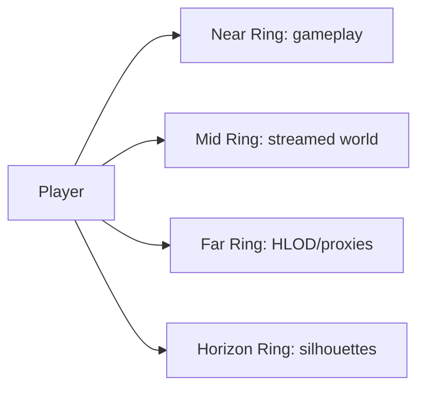

# World And Rendering

> Back to [VRMMO_INDEX.md](VRMMO_INDEX.md)  
> Master blueprint: [VRMMO_DESIGN_BLUEPRINT.md](VRMMO_DESIGN_BLUEPRINT.md)

## Goal

The world should feel like one enormous realm. The player should be able to stand on a mountain, tower, or hill and feel overwhelmed by the scale of visible terrain, cities, forests, and landmarks.

This does not mean everything is simulated everywhere. The design depends on a layered illusion of scale.

## One-Realm Structure

| Region Type | Role |
|---|---|
| Human / Overworld Realm | early and mid-game society, basic trade, entry weapons, social law |
| Dwarf Realm | advanced crafting, legendary forging, socketed weapon blueprints |
| Demon Lands | cursed power, demon eyes, forbidden relics, demon faction access |
| Bandit Territories | black market, smuggling, cursed item economy |
| Ancient Ruins | spellstone discovery, lost grimoires, old weapon series |
| Wild Frontier | rare materials, world bosses, large-scale visual fantasy |

## Distance Rings

| Ring | Range | Contents | Direction |
|---|---:|---|---|
| Near | 0-200 m | full actors, collision, interactables, nearby players | high update rate |
| Mid | 200 m-1.5 km | streamed terrain, structures, selected AI | HLOD and reduced simulation |
| Far | 1.5-16 km+ | forests, cities, mountains, ruins | custom far proxies and baked materials |
| Horizon | 16 km+ | mythic landmarks and silhouettes | visual-only scale signals |

## Unreal Feature Direction

| Feature | Use | Risk |
|---|---|---|
| World Partition | primary world streaming | needs disciplined grid and content rules |
| HLOD | visible distant unloaded cells | automatic HLOD may not be enough |
| Custom HLOD Actors | custom far-world representations | requires engineering |
| Nanite | static meshes, cliffs, buildings, rocks | does not remove optimization needs |
| Nanite Foliage / Voxels | large forests and tree distance | experimental, must be profiled |
| PCG | biome and prop generation | must output streamable optimized content |

## Performance Principles

- The player should see farther than they can interact.
- Distant crowds become silhouettes, banners, aggregate effects, or audio ambience.
- Full simulation is local.
- Distant world state becomes cheaper representations.
- Shadows, foliage, materials, skeletal meshes, and VR stereo cost may matter more than triangle count.

## First Rendering Prototype

The first world-scale test should include:

- 8 km or 16 km square terrain.
- one forest biome.
- one city, castle, or giant visible landmark.
- one mountain range.
- World Partition.
- HLOD.
- custom far proxy layer.
- Nanite foliage test patch.
- simulated player load tests.

